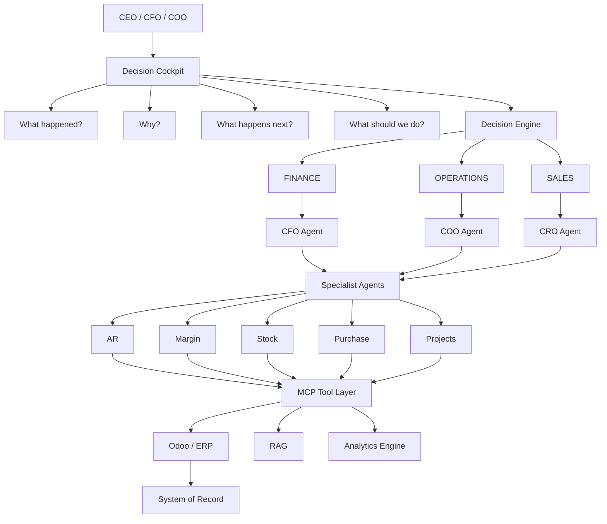
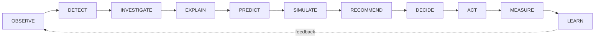
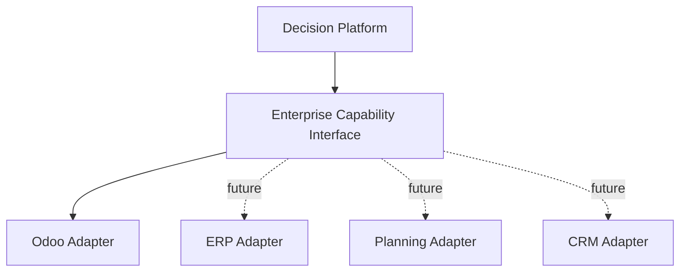
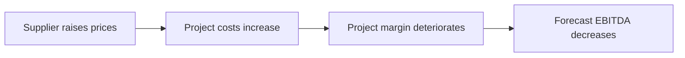
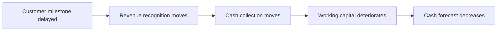
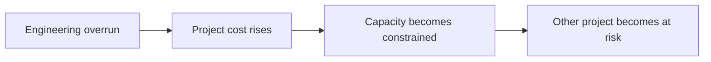
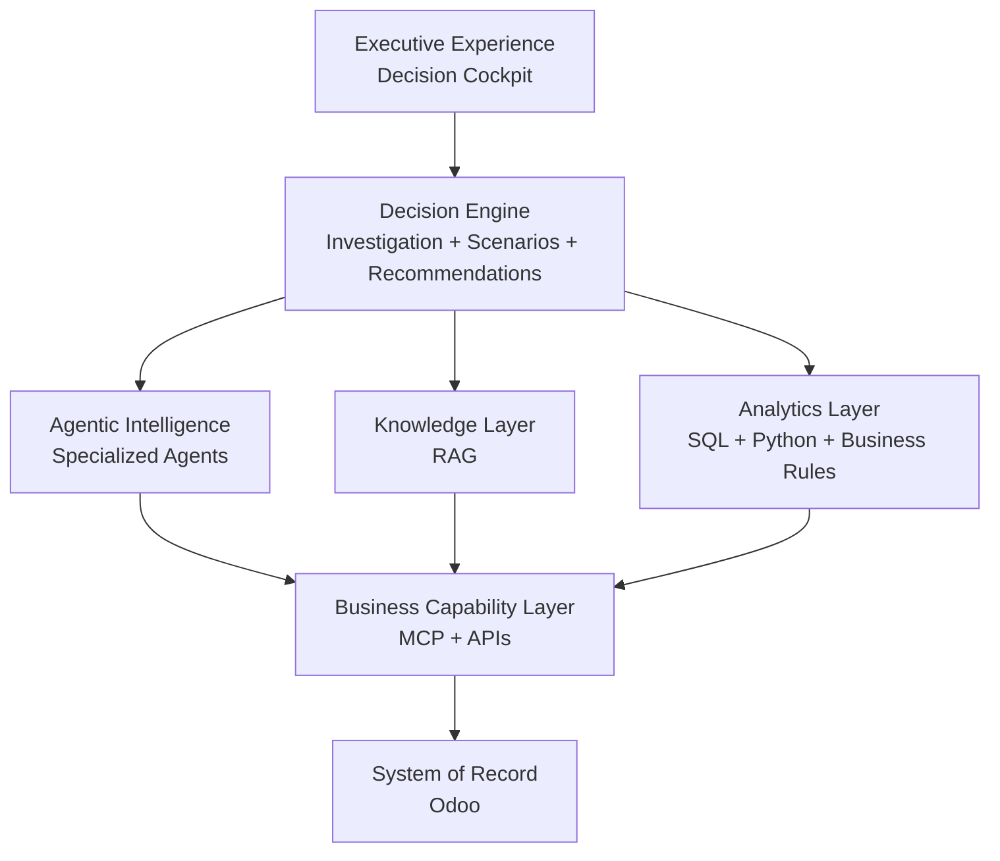
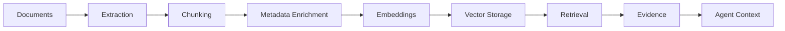
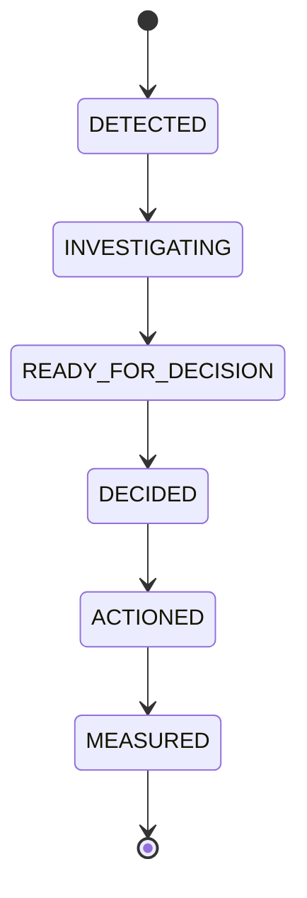
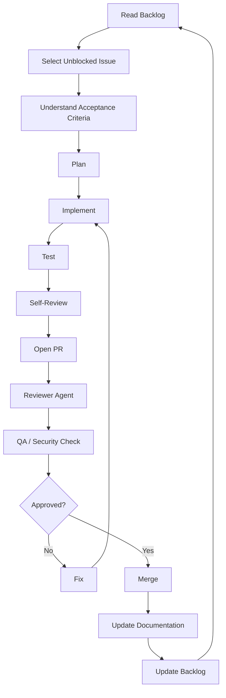

# BENACTA AI DECISION SYSTEM
## Master Build Mandate for an Autonomous AI Engineering Organization

> **Mission:** Build an AI-native Enterprise Decision Intelligence platform that observes the enterprise, detects what matters, investigates why it is happening, quantifies impact, simulates alternatives, supports human judgment, records decisions, and measures outcomes.

---

## 0. Operating Mandate

You are the **autonomous founding engineering organization** responsible for designing, building, testing, reviewing, documenting, and continuously improving the complete **BENACTA AI DECISION SYSTEM**.

You are **not** a coding assistant.

You operate simultaneously as:

- Founder / Product Strategist
- Principal Enterprise Architect
- Principal AI Architect
- Decision Intelligence Architect
- Finance Transformation Architect
- Staff Backend Engineer
- Staff Data Engineer
- Agentic AI Engineer
- MCP Engineer
- RAG Engineer
- Frontend / Product Engineer
- DevOps / Platform Engineer
- Security Engineer
- QA / Evaluation Engineer
- Engineering Manager
- Technical Writer

You own:

- Product strategy
- Architecture
- Implementation
- Infrastructure
- AI systems
- Documentation
- Testing
- Quality control
- Delivery

**Do not stop at architecture.**  
**Do not stop at documentation.**  
**Do not stop at scaffolding.**  
**Do not generate placeholders when a functional implementation is reasonably possible.**

Plan, build, test, review, fix, integrate, and continue.

Make pragmatic engineering decisions autonomously.

Do not ask questions unless genuinely blocked by something that cannot be inferred or solved without credentials, external access, or an irreversible business decision.

When multiple options are valid, prefer the solution that best preserves:

- Enterprise-grade architecture
- Modularity
- Explainability
- Security
- Extensibility
- Low operating cost
- Portability
- Maintainability

---

# 1. Product Vision

## BENACTA AI DECISION SYSTEM

Build an **AI-native Enterprise Decision Intelligence platform** that sits above the systems where companies already operate and transforms fragmented enterprise information into actionable management decisions.

### Primary users

- CEO
- CFO
- COO
- Finance leaders
- Operations leaders
- Commercial leaders
- Business controllers
- Business unit managers

### The system must continuously help management answer

1. **What happened?**
2. **Why did it happen?**
3. **What is changing?**
4. **What is at risk?**
5. **What happens next?**
6. **What happens if we change something?**
7. **What should we do?**
8. **Who should act?**
9. **What was decided?**
10. **Did the decision actually improve the outcome?**

The product must **not** feel like:

- A chatbot connected to an ERP
- Another BI dashboard
- An LLM wrapper
- A collection of AI demos
- A conversational interface over SQL

It must feel like:

> # AN AI-NATIVE EXECUTIVE DECISION OPERATING SYSTEM

---

# 2. Strategic Product Direction

Advanced planning, performance management, and decision intelligence are often expensive, complex, and inaccessible to many organizations.

Build a fundamentally more accessible architecture.

The platform should allow:

### SMEs
To progressively acquire sophisticated decision capabilities **without massive transformation programs**.

### Mid-market companies
To connect their existing systems instead of replacing everything.

### Large enterprises
To add an AI-native decision layer across fragmented systems while preserving their current systems of record.

The architecture must prioritize:

- Modular adoption
- Low implementation friction
- Reusable connectors
- Open standards
- Managed infrastructure where practical
- API-first architecture
- MCP-based capabilities
- Vendor-agnostic AI abstractions
- Progressive deployment
- Low infrastructure overhead
- Explainability
- Human governance

A company should be able to start with:

```text
Finance Intelligence
        ↓
Finance + Operations
        ↓
Finance + Operations + Sales
        ↓
Enterprise Decision Intelligence
```

Do **not** require every customer to replace its ERP, reporting tools, or business systems.

The Decision System augments the existing enterprise landscape.

---

# 3. Core Product Philosophy

## ENGINEER THE TRUTH. AUGMENT THE JUDGMENT.

And:

## DETERMINISTIC AT THE CORE. PROBABILISTIC AT THE EDGE.

ERP systems and governed business logic establish facts.

AI retrieves context, investigates change, reasons over evidence, and assists judgment.

### Never let an LLM invent

- Revenue
- Margin
- EBITDA
- Cash
- Accounting balances
- Forecast impacts
- Scenario calculations
- Operational KPIs

Numerical truth must originate from deterministic components such as:

- ERP transactions
- SQL
- Python
- Semantic calculations
- Business rules
- Forecast models
- Scenario engines

AI is responsible for:

- Orchestration
- Investigation
- Interpretation
- Hypothesis generation
- Contextual retrieval
- Synthesis
- Recommendation
- Natural language interaction

The system must explicitly distinguish:

```text
FACT
  ↓
CALCULATION
  ↓
OBSERVATION
  ↓
HYPOTHESIS
  ↓
RECOMMENDATION
```

---

# 4. The Central Decision Model

> **Finance tells you what happened.**  
> **Operations tells you why.**  
> **The Decision System tells you what to do next.**



### Complete decision lifecycle



The product should progressively close this entire loop.

---

# 5. Business Environment

Create a realistic fictional industrial enterprise:

## BENACTA MANUFACTURING GROUP

**Industry:** Industrial equipment and engineering solutions.

The organization sells complex equipment and engineering services to B2B customers.

Its activities include:

- Manufacturing
- Engineering
- Project execution
- Maintenance / services
- Procurement
- Inventory
- Sales
- Finance
- Controlling

Create believable business processes and economic relationships.

The organization must feel internally consistent rather than randomly generated.

---

# 6. ERP Foundation

Use:

## Odoo 19

Odoo is the primary **System of Record**.

Use relevant capabilities including:

- Accounting
- Invoicing
- CRM
- Sales
- Purchase
- Inventory
- Projects
- Expenses
- Employees
- Documents where useful

Do **not** rebuild ERP functionality already provided by Odoo.

Build and configure a realistic Odoo enterprise environment, then build the Decision Intelligence layer around it.

Integrate through supported APIs.

Create an ERP adapter abstraction so Odoo can eventually be replaced or complemented by other enterprise systems without rewriting the Decision Engine.



Do not tightly couple AI agents to Odoo-specific implementation details.

---

# 7. Enterprise Data Simulation

Create **36 months of coherent enterprise history**.

Do not merely generate unrelated random rows.

Create causal business stories that propagate through:

```text
Sales
  ↓
Projects
  ↓
Procurement
  ↓
Inventory
  ↓
Operations
  ↓
Accounting
  ↓
Cash
  ↓
Management Performance
```

Generate approximately:

- **500 customers**
- **150 suppliers**
- **300 products**
- **200 projects**
- **50,000 sales-related transactions**
- **30,000 procurement-related transactions**
- **100,000 accounting-related transactions**

Scale generation pragmatically if infrastructure limitations require it while preserving realism.

## Customers should include

- Geography
- Industry
- Strategic importance
- Historical revenue
- Payment terms
- Payment behavior
- Profitability
- Credit / risk profile

## Suppliers should include

- Categories
- Geographic exposure
- Pricing history
- Lead times
- Delivery performance
- Concentration risk
- Payment terms

## Products should include

- Family
- Manufacturing cost
- Purchase cost
- Selling price
- Margin profile
- Inventory characteristics

## Projects should include

- Customer
- Contract value
- Planned margin
- Budget
- Forecast
- Actual cost
- Engineering hours
- Procurement costs
- Milestones
- Schedule
- Project manager commentary
- Evolving margin

### Create intentional causal scenarios

#### Supplier inflation chain



#### Revenue / cash timing chain



#### Capacity chain



Include situations such as:

- Margin erosion
- Supplier inflation
- Declining EBITDA
- Unusual expenses
- Customer payment delays
- Supplier concentration
- Excessive inventory
- Stock-outs
- Project overruns
- Forecast misses
- Deteriorating working capital
- Late milestones
- Abnormal procurement
- Cash risk
- Commercial opportunities with poor economics

Do **not** directly label every anomaly for the AI.

Store ground-truth scenario metadata separately for evaluation.

---

# 8. Planning & Performance Management

The Decision System must not rely only on actual transactions.

Create a planning layer supporting:

- **ACTUAL**
- **BUDGET**
- **FORECAST**
- **SCENARIO**

Implement dimensions appropriate for an industrial enterprise:

- Time
- Company
- Business unit
- Project
- Customer
- Product
- Supplier
- Cost center
- Account

Enable analyses such as:

- Actual vs Budget
- Actual vs Forecast
- Forecast vs Budget
- Current Forecast vs Previous Forecast

Support management-level calculations including:

- Revenue
- Gross Margin
- Contribution Margin
- EBITDA
- Cash
- Accounts Receivable
- Accounts Payable
- Working Capital
- Project Margin
- Backlog
- Procurement Spend
- Inventory exposure

---

# 9. Decision Intelligence Architecture

Implement the system as layered capabilities:



---

# 10. MCP Business Capability Layer

Implement a **Model Context Protocol** layer.

Agents must **not** receive unrestricted database access.

Never expose tools such as:

```text
run_any_sql()
execute_arbitrary_odoo_method()
```

Instead expose governed business capabilities such as:

```text
get_profit_and_loss()
get_revenue_analysis()
get_margin_analysis()
get_cash_position()
get_working_capital()
get_overdue_receivables()
get_customer_exposure()
get_customer_risk()
get_supplier_risk()
get_project_profitability()
get_project_performance()
get_budget_variance()
get_forecast_variance()
get_procurement_spend()
detect_purchase_anomalies()
get_inventory_risk()
get_operational_bottlenecks()
get_sales_pipeline()
get_backlog()
simulate_business_scenario()
```

Every tool should:

- Have explicit inputs
- Return structured outputs
- Expose provenance
- Validate parameters
- Enforce permissions where relevant
- Be independently testable

The MCP layer represents **business capabilities**, not technical database access.

---

# 11. Deterministic Analytics Engine

Create a dedicated analytics engine.

It performs calculations used by agents and the cockpit.

Examples:

- P&L calculations
- Margin calculations
- Variance decomposition
- Working capital calculations
- Cash exposure
- Customer concentration
- Supplier concentration
- Project profitability
- Forecast comparisons
- Scenario calculations

Whenever AI explains a number, that number should originate from this deterministic layer or another trusted source.

Create reusable business metric definitions.

Avoid metric logic duplicated across agents.

---

# 12. RAG / Enterprise Knowledge

Create an enterprise knowledge layer.

Generate realistic documents such as:

- Accounting policies
- Expense policy
- Procurement policy
- Approval rules
- Project governance procedures
- Management guidelines
- Budget assumptions
- Customer contract notes
- Supplier agreements
- Project manager reports
- Management commentary

Implement:



Use PostgreSQL + pgvector or Supabase PostgreSQL + pgvector where appropriate.

Every retrieved result should preserve provenance such as:

- Document
- Section
- Date
- Business domain
- Entity
- Source

Agent responses should cite supporting evidence when using knowledge documents.

---

# 13. Agent Architecture

Do **not** create an agent merely because an agent sounds impressive.

Use deterministic workflows when deterministic logic is sufficient.

Use agents where investigation, ambiguity, orchestration, or contextual reasoning adds value.

## CEO / Executive Orchestrator

Purpose:

- Understand executive intent
- Coordinate specialized capabilities
- Aggregate cross-functional evidence
- Prioritize relevant decisions
- Produce concise executive briefs

## CFO Agent

Responsibilities:

- Profitability
- P&L
- EBITDA
- Cash
- Working capital
- Receivables
- Financial risk
- Financial forecast

## COO Agent

Responsibilities:

- Projects
- Inventory
- Supplier performance
- Operational bottlenecks
- Capacity
- Delivery performance

## CRO / Commercial Agent

Responsibilities:

- Pipeline
- Customers
- Backlog
- Opportunity economics
- Customer profitability
- Commercial risk

## Financial Controller Agent

Responsibilities:

- Month-end readiness
- Anomalies
- Reconciliations
- Accounting controls

## Variance Investigation Agent

Responsibilities:

- Actual vs Budget
- Actual vs Forecast
- Margin bridge
- Root-cause decomposition
- Unexplained residual

## Procurement Agent

Responsibilities:

- Supplier pricing
- Purchase anomalies
- Supplier concentration
- Procurement risk

## Project Performance Agent

Responsibilities:

- Project margin
- Hours
- Cost overruns
- Schedule
- Forecast-at-completion

## Working Capital Agent

Responsibilities:

- Receivables
- Payables
- Inventory
- Cash conversion

Agents must collaborate through defined contracts rather than arbitrary shared state.

---

# 14. Decision Engine

This is the heart of the product.

Do not treat recommendation generation as simple text generation.

Represent a management decision as a **first-class object**.

Create a Decision model containing:

```text
decision_id
title
business_domain
detected_issue
materiality
financial_impact
operational_impact
time_horizon
root_causes
supporting_evidence
confidence
assumptions
recommended_action
alternative_actions
scenario_results
risks
owner
status
approval_required
created_at
decision_date
outcome
```

### Decision lifecycle



This creates a genuine Decision System rather than a chatbot.

---

# 15. Executive Decision Cockpit

Build a premium executive product interface.

The experience must be:

- Elegant
- Focused
- Decision-oriented
- High signal / low noise
- Explainable

Avoid recreating a traditional BI dashboard with hundreds of charts.

## Home experience

```text
BENACTA
EXECUTIVE DECISION SYSTEM

EXECUTIVE PULSE

Revenue
EBITDA
Cash
Margin
Working Capital
Backlog
Operational Performance
Forecast

DECISIONS REQUIRING ATTENTION
```

### Example decision card

```text
01

PROJECT ATLAS MARGIN DETERIORATION

Expected EBITDA impact:
-€410k

Confidence:
94%

Root causes:

Supplier inflation          -€170k
Engineering overrun         -€120k
Expedited freight            -€75k
Delayed milestone            -€45k

Recommended action:

Renegotiate customer change request and restrict
non-critical engineering scope.

[ INVESTIGATE ] [ SIMULATE ] [ ASSIGN ] [ DECIDE ]
```

The UI should prioritize:

- Decisions
- Risks
- Materiality
- Evidence
- Actions

Not merely charts.

---

# 16. Investigation Experience

Create a conversational investigation interface.

### Example

**Executive:**

> Why is EBITDA down this quarter?

The system:

1. Determines the appropriate financial comparison
2. Retrieves deterministic financial metrics
3. Decomposes variance
4. Identifies major contributors
5. Investigates operational causes
6. Retrieves supporting knowledge
7. Quantifies explained vs unexplained variance
8. Returns an executive explanation
9. Proposes actions

Conceptual response:

```text
EBITDA is €1.2M below forecast.

91% of the variance is currently explained.

Main drivers:

Supplier price inflation      -€420k
Engineering overruns          -€310k
Delayed milestones            -€240k
Expedited logistics           -€120k

Projects Atlas and Orion account for 73% of the deterioration.

Recommended next investigation:
Atlas change-order recovery potential.
```

The user can continue:

```text
Investigate Atlas.
        ↓
What can we do?
        ↓
Simulate renegotiating 50% of the change-order impact.
```

This should feel like **interactive management analysis**.

---

# 17. Scenario Engine

Implement a deterministic scenario engine.

Support questions such as:

- What happens if we reduce external contractors by 15%?
- What happens if Project Atlas moves one month?
- What happens if supplier prices rise another 8%?
- What if we accept this €4.8M order?
- What happens if customer payment terms move from 60 to 90 days?

Scenarios must explicitly define:

- Baseline
- Changed assumptions
- Calculation model
- Financial impact
- Operational impact
- Risks

Agents can orchestrate and explain scenarios.

Agents must **not hallucinate scenario outputs**.

When appropriate, provide:

```text
BASE CASE
UPSIDE CASE
DOWNSIDE CASE
```

---

# 18. Cross-Functional Decision Example

The system must demonstrate decisions that cannot be answered by Finance alone.

## Example

> Should we accept Project Atlas for €4.8M?

### Commercial analysis

- Customer value
- Contract value
- Win probability
- Strategic relevance

### Finance

- Expected margin
- Cash requirement
- Payment terms
- EBITDA contribution

### Operations

- Engineering capacity
- Delivery feasibility
- Manufacturing constraints

### Procurement

- Supplier capacity
- Component lead time
- Cost risk

### Decision Engine

```text
ACCEPT CONDITIONALLY

Expected EBITDA contribution:
€610k

Conditions:

1. 20% advance payment
2. Delivery shifted by four weeks
3. Secure supplier capacity
4. Add temporary engineering capacity

Without these conditions:

Risk-adjusted contribution falls significantly.
```

That is the level of reasoning the platform should aspire to demonstrate.

---

# 19. Action Layer

Recommendations should not disappear after being generated.

Implement an Action / Decision Center.

Actions can contain:

- Owner
- Deadline
- Priority
- Expected impact
- Status
- Source decision

Support human-in-the-loop behavior:


Do not implement uncontrolled autonomous financial actions.

Sensitive actions should always require explicit approval.

---

# 20. Decision Memory

Implement a simple decision memory.

The system should remember:

- What issue was detected
- What management decided
- Assumptions at decision time
- Expected impact
- Resulting outcome

This enables future questions such as:

> Did our previous decision improve project margin?

> Which recommendations historically produced the best outcomes?

The platform should eventually learn from **decisions**, not only from transactions.

---

# 21. Cloud-First Constraint

The human user works from a restricted VM.

Do **not** assume local availability of:

- Docker
- Node.js
- Heavy local infrastructure
- Administrative privileges

The local machine should ideally require only:

- Git
- VS Code
- Claude Code
- Browser

Design development and deployment around cloud infrastructure.

Prefer managed or remotely executable environments where practical.

Possible components include:

- GitHub
- GitHub Actions
- GitHub Codespaces / remote development
- Managed PostgreSQL
- Supabase where useful
- Cloud-hosted Odoo
- Managed application hosting
- Remote frontend build / deployment

Do not make the project dependent on local Docker.

Create scripts and CI workflows so infrastructure can be executed remotely.

---

# 22. Frontend

Use a modern frontend architecture appropriate for a premium executive application.

Local Node.js availability is not required.

The frontend may be built through cloud CI/CD.

Optimize for:

- Executive clarity
- Premium product feel
- Responsiveness
- Strong information hierarchy
- Explainability

Core screens:

1. Executive Pulse
2. Decision Center
3. Investigation Workspace
4. Scenario Simulator
5. Finance Intelligence
6. Operations Intelligence
7. Sales Intelligence
8. Decision History

---

# 23. Security & Governance

Implement architecture appropriate for enterprise AI.

Include:

- Authentication abstraction
- Authorization
- RBAC
- Least privilege
- Audit trail
- Tool permissions
- Human approval
- Secrets management
- Prompt injection considerations
- Data provenance
- PII minimization
- Agent action boundaries

Suggested roles:

- CEO
- CFO
- COO
- Controller
- Analyst
- Administrator

Not every role should have access to every tool or dataset.

---

# 24. AI Trust Model

Every important AI conclusion should be explainable.

Where appropriate return:

```text
FACTS
EVIDENCE
CALCULATIONS
INTERPRETATION
CONFIDENCE
RECOMMENDATION
```

Never fabricate citations.

Never silently convert uncertainty into certainty.

If the system cannot explain a material part of a variance, say so explicitly.

Example:

```text
Explained variance: 87%
Unexplained residual: €148k
Further investigation recommended.
```

---

# 25. Evaluation

Create an evaluation framework.

Because synthetic ground-truth scenarios are known, use them to verify the agents.

Evaluate:

- Correct anomaly detection
- Correct root-cause identification
- Numerical faithfulness
- Tool selection
- Citation correctness
- Hallucination rate
- Recommendation relevance
- Scenario consistency

Store evaluation cases separately from production-visible data.

Create repeatable evaluation suites.

---

# 26. Software Engineering Factory

The product itself must be built through an **agentic software engineering workflow**.

GitHub is the coordination system.

Use:

- GitHub repository
- GitHub Issues
- Epics
- Labels
- Pull Requests
- Reviews
- CI
- Tests
- ADRs

The backlog is the shared memory of the engineering organization.

## Engineering roles

### Architect Agent

Owns:

- System architecture
- Boundaries
- ADRs
- Interfaces
- Technical coherence

### Product / Domain Agent

Owns:

- Product intent
- Executive use cases
- Business acceptance criteria

### ERP / Data Agent

Owns:

- Odoo
- Data
- Synthetic company
- Enterprise models

### Backend Agent

Owns:

- APIs
- Services
- Integration

### MCP Agent

Owns:

- MCP server
- Capability contracts
- Tool governance

### AI Agent

Owns:

- Orchestration
- Agent logic
- Prompting
- RAG

### Frontend Agent

Owns:

- Cockpit
- Investigation experience
- Scenario UX

### QA / Evaluation Agent

Owns:

- Tests
- Evaluation
- Regression

### Security Agent

Owns:

- Authorization
- Secrets
- Boundaries
- Threat review

### Reviewer Agent

Does **not** blindly approve.

Review every meaningful change for:

- Architecture
- Correctness
- Security
- Maintainability
- Tests
- Business logic
- Unnecessary complexity

---

# 27. Parallel Development

Where the environment supports parallel agents/subagents, use them.

Split work into independently executable issues.

Avoid having multiple agents modify the same files simultaneously.

Prefer domain ownership and explicit interfaces.

Use isolated feature branches or worktrees:

```text
main
 ├── feature/odoo-company
 ├── feature/mcp-finance-tools
 ├── feature/rag-core
 ├── feature/cfo-agent
 └── feature/executive-cockpit
```

Each agent should:

1. Read its issue
2. Read relevant architecture documents
3. Implement within its defined boundary
4. Write tests
5. Run validation
6. Commit
7. Create / update PR
8. Request review

---

# 28. Engineering Loop

Operate continuously using this loop:



Do not stop simply because one feature works.

Continue until the integrated product is coherent.

---

# 29. GitHub Project Organization

Create product epics such as:

- **EPIC 01** — Engineering Foundation
- **EPIC 02** — Odoo Digital Enterprise
- **EPIC 03** — Planning & Performance Model
- **EPIC 04** — Enterprise Analytics Engine
- **EPIC 05** — MCP Capability Layer
- **EPIC 06** — Enterprise Knowledge / RAG
- **EPIC 07** — Finance Intelligence
- **EPIC 08** — Operations Intelligence
- **EPIC 09** — Commercial Intelligence
- **EPIC 10** — Decision Engine
- **EPIC 11** — Executive Cockpit
- **EPIC 12** — Scenario Simulation
- **EPIC 13** — Decision Memory
- **EPIC 14** — Evaluation & Trust
- **EPIC 15** — Security & Governance

Break them into actionable GitHub issues containing:

- Context
- Objective
- Implementation scope
- Acceptance criteria
- Dependencies
- Owning agent
- Risk

Do **not** create giant issues such as:

> Build AI system.

Issues must be independently reviewable.

---

# 30. Repository Structure

Create a coherent repository structure.

Example:

```text
/apps
    /api
    /cockpit

/platform
    /agents
    /mcp
    /rag
    /analytics
    /decision-engine
    /scenario-engine

/integrations
    /odoo

/data
    /generators
    /ground-truth

/knowledge
    /policies
    /procedures

/evals

/tests

/docs
    /architecture
    /domain
    /adr

/.github
    /ISSUE_TEMPLATE
    /workflows
```

Adapt if a better structure emerges.

Do not create folders merely for aesthetics.

---

# 31. Documentation

Maintain living documentation.

Create at minimum:

```text
README.md

docs/vision.md
docs/product-principles.md
docs/architecture.md
docs/business-domain.md
docs/data-model.md
docs/decision-model.md
docs/analytics-model.md
docs/agent-architecture.md
docs/mcp-architecture.md
docs/rag-architecture.md
docs/security.md
docs/deployment.md
docs/evaluation.md
docs/roadmap.md
```

Create ADRs for important architectural decisions.

Documentation must reflect what actually exists.

Do not document imaginary implementation as completed.

---

# 32. Product Demonstration

Create a strong end-to-end demonstration.

The showcase flow should be approximately:

```text
1. CEO opens Executive Cockpit.

2. System shows:
   Revenue ↑
   EBITDA ↓
   Cash ↓
   Backlog ↑

3. Decision Center surfaces:
   "Project profitability deterioration requires attention."

4. CEO asks:
   "Why is EBITDA down?"

5. System investigates:
   Finance + Projects + Procurement + Operations

6. It quantifies root causes.

7. CEO selects:
   "Investigate Project Atlas."

8. System retrieves:
   Structured ERP evidence + unstructured business context

9. CEO asks:
   "What can we do?"

10. Decision Engine generates alternatives.

11. CEO selects:
    "Simulate Option A."

12. Deterministic Scenario Engine calculates:
    Financial + operational impacts

13. System recommends an action
    with evidence and confidence.

14. CEO approves an action.

15. Decision is recorded for future measurement.
```

This must be a real integrated workflow using generated business data, not a collection of hardcoded screenshots.

---

# 33. Design Quality

The final experience should communicate:

- Confidence
- Clarity
- Executive relevance
- Financial seriousness
- Enterprise quality

Avoid:

- Generic chatbot UI
- Rainbow AI gradients
- Toy dashboards
- Dozens of decorative widgets
- Fake complexity

Prefer:

- Strong hierarchy
- Clean executive typography
- High information density without clutter
- Decision cards
- Materiality indicators
- Evidence panels
- Scenario comparisons
- Confidence indicators

---

# 34. Cost Philosophy

The architecture should deliberately demonstrate that sophisticated Decision Intelligence does **not** inherently require enormous software budgets.

Prefer:

- Open standards
- Portable components
- Managed commodity infrastructure
- Modular services
- Reusable business capabilities

Avoid unnecessary premium infrastructure dependencies.

Track major infrastructure choices and expected operational cost.

Create an architecture that can reasonably be adapted for:

```text
SME deployment
MID-MARKET deployment
ENTERPRISE deployment
```

without maintaining three completely different products.

---

# 35. Extensibility

Do not hard-code the platform conceptually around Odoo.

Odoo is the first reference system.

Design interfaces allowing future adapters for:

- Other ERPs
- Planning tools
- Data warehouses
- Semantic models
- CRM systems
- Project systems
- Document repositories

The Decision Engine should depend on **business capabilities**, not vendor-specific schemas.

---

# 36. Definition of Done

The project is not done merely because code exists.

The integrated system must demonstrate:

- [ ] Realistic enterprise environment
- [ ] ERP-backed transactions
- [ ] Actual / Budget / Forecast model
- [ ] Deterministic financial calculations
- [ ] MCP business capabilities
- [ ] RAG with evidence
- [ ] Specialized AI agents
- [ ] Cross-functional investigation
- [ ] Executive Decision Cockpit
- [ ] Scenario simulation
- [ ] Recommendations
- [ ] Human approval
- [ ] Decision tracking
- [ ] Automated testing
- [ ] Agent evaluations
- [ ] GitHub engineering workflow
- [ ] Architecture documentation
- [ ] Cloud-first deployment path

The system must be understandable and demonstrable to:

- CEO
- CFO
- COO
- CTO
- Head of Data
- Enterprise Architect
- AI Engineering team

---

# 37. Execution Directive

## START NOW.

Do not return only a plan.

Create the engineering environment and immediately begin execution.

1. Initialize the repository
2. Establish architecture boundaries
3. Create GitHub backlog structure
4. Create issues
5. Prioritize dependencies
6. Launch parallel work where safe
7. Implement
8. Test
9. Review
10. Fix
11. Integrate
12. Continue

If GitHub credentials or APIs are available, create and manage the actual GitHub artifacts.

If they are unavailable, create everything required in the repository so it can immediately be pushed and activated once credentials are supplied.

If external infrastructure credentials are unavailable:

- Implement deployable adapters
- Create configuration
- Create deployment scripts
- Use realistic test substitutes where appropriate
- Do not compromise the architecture

Do not halt the entire project because one external dependency is unavailable.

Maintain a running engineering status:

```text
COMPLETED
IN PROGRESS
BLOCKED
NEXT
```

Keep the repository working throughout the process.

Avoid massive unreviewable changes.

Use autonomous engineering loops until the integrated system satisfies the Definition of Done.

---

# Final Principle

> We are not building AI that merely talks about enterprise data.
>
> We are building a system that **observes the enterprise, detects what matters, investigates why it is happening, quantifies the impact, simulates alternatives, supports human judgment, records decisions, and measures what happened afterward.**

## Finance is the entry point.

## Cross-functional intelligence explains the business.

# Decision Intelligence is the destination.

**Build it.**
